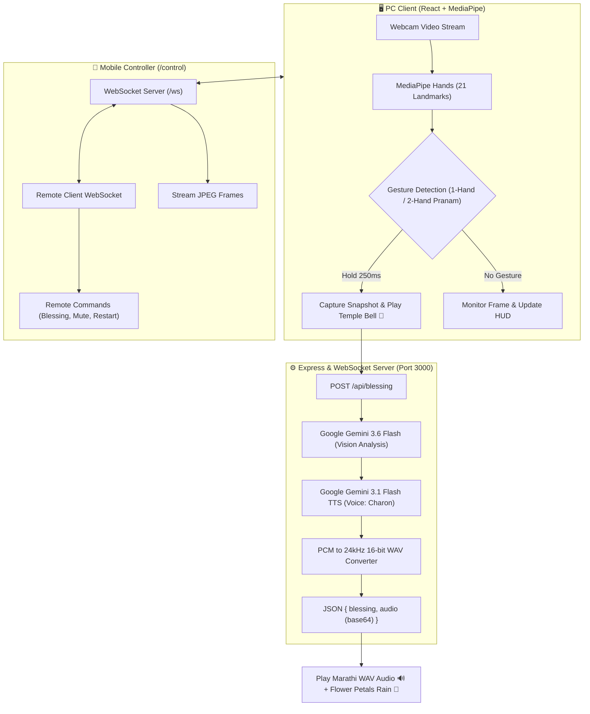

# 🐘 AI Bappa Maza (माझा AI बाप्पा)

> **Interactive Real-Time Devotional Darshan & AI Blessing Experience**  
> Powered by Computer Vision, Multimodal Google Gemini Vision, Divine Marathi Voice Synthesis (TTS), and Real-Time WebSocket Remote Control.

[](https://react.dev/)
[](https://vitejs.dev/)
[](https://expressjs.com/)
[](https://ai.google.dev/)
[](https://developers.google.com/mediapipe)
[](https://github.com/websockets/ws)
[-FF9933?style=for-the-badge)](https://en.wikipedia.org/wiki/Marathi_language)

---

## 📸 Visual Showcase

### 🖥️ Main PC Darshan Dashboard
*Full interactive devotee darshan screen featuring real-time camera tracking, gesture HUD gauge, divine Ganesha aura, live Marathi blessing card, 7-bar audio waveform, and sensor diagnostics.*

<div align="center">
  
</div>

<br />

### 📱 Mobile Remote Controller (`/control`)
*Low-latency smartphone companion interface to live-stream the main webcam view, monitor devotee gestures, remotely trigger blessings, control audio/music/camera, and restart the backend.*

<div align="center">
  
</div>

---

## ✨ Key Features

- **🙏 Real-Time Pranam / Namaskar Gesture Recognition**:
  - Leverages Google MediaPipe Hands (21 3D landmarks) running directly in the browser.
  - Supports both **1-Hand Pranam** (Upright open palm) and **2-Hand Namaskar** (Hands folded together).
  - Ultra-fast **250ms hold detection** with circular SVG progress meter and smooth decay physics.

- **👁️ Multimodal Visual AI & Personalized Marathi Blessings (`gemini-3.6-flash`)**:
  - When Pranam is held, a high-resolution snapshot is sent to Google Gemini.
  - The AI observes the devotee's real-time expression, eyes (calm, focused, energetic), smile, and posture.
  - Generates a warm, deeply personalized Marathi blessing (आशीर्वाद) coupled with practical, caring **health & wellness advice** (eye care, posture, hydration, pranayama, balanced sleep). *(Zero bias / comments on clothing).*

- **🎙️ Divine Marathi Voice Synthesis (`gemini-3.1-flash-tts-preview`)**:
  - Generates divine spoken Marathi audio using the `Charon` voice model.
  - Converts raw PCM audio output into high-fidelity 24,000 Hz 16-bit mono WAV in real-time.

- **📱 Mobile Web Remote Controller (`/control`)**:
  - Connect any mobile device instantly by scanning the on-screen QR Code.
  - **Live Video Streaming**: Real-time JPEG canvas stream piped over WebSockets to the mobile screen.
  - **Remote Actions**: Manual blessing trigger, audio replay, sound mute/unmute, background music toggle, camera toggle, gesture detection toggle, and server restart.

- **🔔 Devotional Audio Engine & Soundscapes**:
  - Web Audio API harmonic oscillator synthesizing an authentic **Temple Bell (घंटा नाद)** upon gesture trigger.
  - Background devotional ambient chime during AI processing.
  - Foreground devotional music playlist with smooth audio ducking when blessings are spoken.

- **🌸 Spiritual Particle Physics & Visuals**:
  - Dynamic flower petal shower (झेंडू / Marigold & जास्वंद / Hibiscus rain) on every generated blessing.
  - Floating spiritual golden dust particles with canvas physics.
  - Rotating divine aura, pulsing glowing crown, and 7-bar animated audio waveform.

- **🔄 One-Click Graceful Server Restart & Auto-Port Management**:
  - Server restart accessible from both PC Header and Mobile Controller.
  - Built-in automatic port cleanup and port conflict auto-recovery (`port 3000`).

- **🚩 100% Native Marathi Cultural Experience**:
  - Entire user interface, voice audio, blessings, diagnostics, and instructions are crafted in **Marathi (मराठी / Devanagari script)**.

---

## 🏗️ Architecture & Data Flow



---

## 🗂️ Project Structure

```
ai-bappa-maza/
├── server/                          # Express backend & WebSocket server
│   ├── index.js                     # Server entrypoint & port recovery
│   ├── app.js                       # Express app configuration & middleware
│   ├── config/                      # Environment variables & constants
│   ├── constants/
│   │   └── themes.js                # Blessing themes (Health, Wisdom, Success, Peace)
│   ├── routes/
│   │   ├── blessing.js              # POST /api/blessing (Gemini text + TTS)
│   │   ├── control.js               # /api/server-info, /api/control/command, /api/server/restart
│   │   ├── music.js                 # GET /api/music/foreground (Playlist tracks)
│   │   └── health.js                # GET /api/health
│   ├── services/
│   │   ├── gemini.js                # Google GenAI SDK integration (Vision + Charon TTS)
│   │   ├── restart.js               # Safe nodemon restart trigger
│   │   └── websocket.js             # WebSocket server for PC & Mobile controller sync
│   └── utils/
│       ├── audio.js                 # PCM to WAV audio buffer conversion
│       └── port.js                  # Automatic port freeing & process cleanup
├── src/                             # React 19 frontend (Vite)
│   ├── main.jsx                     # React entrypoint
│   ├── App.jsx                      # Route switcher (Main Darshan vs /control)
│   ├── containers/
│   │   ├── AppContainer.jsx         # Main PC Darshan container orchestrator
│   │   └── ControlContainer.jsx     # Mobile Remote Controller container (/control)
│   ├── components/                  # Presentational UI components
│   │   ├── Header.jsx               # Header with Om, Marathi title, Remote & Restart modals
│   │   ├── CameraCard.jsx           # Webcam feed, hand landmarks canvas & circular hold HUD
│   │   ├── ControlsRow.jsx          # Blessing trigger, detection toggle, sound, camera & replay
│   │   ├── BappaHero.jsx            # Divine Bappa icon, rotating aura & shloka
│   │   ├── BlessingCard.jsx         # Live blessing text, spiritual spinner & 7-bar waveform
│   │   ├── DiagnosticsPanel.jsx     # FPS, posture status, confidence % and vertical alignment
│   │   ├── InstructionSteps.jsx     # 3 step visual guide in Marathi
│   │   ├── ParticlesBackground.jsx  # Fixed canvas for spiritual dust & flower petal showers
│   │   ├── QrModal.jsx              # Modal with QR code for quick mobile connection
│   │   ├── RestartConfirmModal.jsx  # Modal for server restart confirmation
│   │   └── control/                 # Specialized Mobile Controller components
│   │       ├── ControlActions.jsx
│   │       ├── ControlHeader.jsx
│   │       ├── ControlLiveStream.jsx
│   │       └── ControlStatusCard.jsx
│   ├── hooks/                       # Custom React hooks
│   │   ├── useMediaPipeHands.js     # MediaPipe camera stream, gesture evaluation & landmark draw
│   │   ├── useAudioEngine.js        # Web Audio API temple bell, foreground playlist & ambience
│   │   ├── useBlessing.js           # API dispatch, devotee snapshot, TTS audio playback & cooldown
│   │   ├── useSpiritualParticles.js # Canvas particle physics & Marigold/Hibiscus petal animation
│   │   ├── usePcRemoteBroadcaster.js# Canvas frame streaming & state broadcasting to mobile
│   │   ├── useRemoteController.js   # Mobile WebSocket listener & command dispatcher
│   │   └── useServerRestart.js      # Server restart modal state & API trigger
│   ├── services/
│   │   └── api.js                   # API client (postBlessing, fetchForegroundMusicList, etc.)
│   ├── utils/
│   │   ├── gesture.js               # 3D Euclidean distance & upright Pranam / Namaskar logic
│   │   ├── sound.js                 # Web Audio API harmonic oscillator synthesis
│   │   └── particles.js             # Petal and particle physics
│   ├── constants/
│   │   ├── config.js                # Timing constants, hold time (250ms), cooldown (10s), etc.
│   │   └── marathiStrings.js        # Centralized Marathi text constants
│   └── styles/                      # Modular CSS stylesheets
│       ├── variables.css            # Saffron, gold, crimson color tokens
│       ├── global.css               # Base layout, glassmorphism cards & typography
│       ├── animations.css           # Keyframe animations (aura spin, pulse, waveforms)
│       └── control.css              # Responsive styles for mobile remote
├── public/                          # Static assets
│   ├── background_music.mp3         # Devotional ambient chime
│   └── forground_music/             # Devotional audio playlist tracks
├── vite.config.mjs                  # Vite configuration & `/api` proxy
├── package.json                     # Dependencies & scripts
└── .env                             # Environment configuration (API Key)
```

---

## ⚡ Tech Stack

| Layer | Technology | Purpose |
|---|---|---|
| **Frontend Framework** | React 19 + Vite | High-performance reactive UI with fast build times |
| **Computer Vision** | Google MediaPipe Hands | 21 3D hand landmark tracking running client-side at ~30-60 FPS |
| **Multimodal AI** | Google Gemini `gemini-3.6-flash` | Real-time image observation, devotee analysis & personalized Marathi blessing generation |
| **Voice Synthesis (TTS)** | Google Gemini `gemini-3.1-flash-tts-preview` | Divine spoken Marathi voice generation (`Charon` voice) |
| **Backend & APIs** | Node.js + Express 5.x | REST API endpoints, static bundle hosting & process management |
| **Real-Time Sync** | WebSocket (`ws`) | Bidirectional PC-Mobile state sync and JPEG video streaming |
| **Audio Engine** | Web Audio API | Harmonic bell oscillator synthesis, playlist looping & audio ducking |
| **Styling & Effects** | Vanilla CSS + HTML5 Canvas | Premium glassmorphism design tokens, particle physics & animations |

---

## 🚀 Getting Started

### 1. Prerequisites
- **Node.js**: `v18.0.0` or higher
- **npm**: `v9.0.0` or higher
- **Webcam**: Attached camera for hand gesture detection and visual blessing analysis
- **Google Gemini API Key**: Obtain one from [Google AI Studio](https://aistudio.google.com/)

### 2. Clone & Install Dependencies

```bash
# Clone the repository
git clone https://github.com/anuragarwalkar/ai-bappa-maza.git

# Navigate into project directory
cd ai-bappa-maza

# Install dependencies
npm install
```

### 3. Setup Environment Variables

Create a `.env` file in the root directory:

```env
GEMINI_API_KEY=your_google_gemini_api_key_here
PORT=3000
```

### 4. Run Development Mode

```bash
npm run dev
```

This concurrently starts:
- **Backend Express & WebSocket Server**: `http://localhost:3000`
- **Vite Dev Server (HMR)**: `http://localhost:5173` (proxied to port 3000)

### 5. Open in Browser

- 🖥️ **Main Darshan Dashboard**: [http://localhost:5173](http://localhost:5173) (or `http://localhost:3000`)
- 📱 **Mobile Remote Controller**: [http://localhost:3000/control](http://localhost:3000/control) (or scan the QR code from the PC header)

---

## 📱 Mobile Remote Controller Experience

The mobile remote controller provides seamless companion control during celebrations or gatherings:

1. Click the **📱 मोबाईल रिमोट** button on the PC Header to open the QR Code modal.
2. Scan the QR code using your smartphone's camera.
3. Your mobile browser immediately connects to `/control` via WebSockets:
   - 📺 **Live Video Stream**: Watch the PC webcam feed with detection markers directly on your phone.
   - 🙏 **आशीर्वाद घ्या (Get Blessing)**: Manually trigger a blessing without showing hands to the camera.
   - 🖐️ **हात शोधणे सुरू/बंद (Toggle Detection)**: Temporarily pause gesture detection.
   - 📷 **कॅमेरा सुरू/बंद (Toggle Camera)**: Remotely toggle the PC webcam.
   - 🔁 **पुन्हा ऐका (Replay Blessing)**: Replay Bappa's latest spoken blessing.
   - 🔊 **आवाज सुरू/बंद (Mute Audio)**: Mute or unmute all sound.
   - 🎵 **भक्ती संगीत सुरू/बंद (Toggle Music)**: Toggle devotional playlist tracks.
   - 🔄 **सर्व्हर रीस्टार्ट (Restart Server)**: Gracefully restart the backend with a tap.

---

## 🔌 API & WebSocket Reference

### REST API Endpoints

| Method | Endpoint | Description |
|---|---|---|
| `POST` | `/api/blessing` | Generates personalized Marathi blessing text and synthesized WAV audio. Accepts optional `{ image: "base64..." }`. |
| `GET` | `/api/server-info` | Returns local network IP, active port, and mobile control URL. |
| `GET` | `/api/control/state` | Returns current cached system state. |
| `POST` | `/api/control/command` | REST fallback to dispatch remote control commands. |
| `POST` | `/api/server/restart` | Initiates graceful server restart and port release. |
| `GET` | `/api/music/foreground` | Returns list of available foreground devotional music tracks. |
| `GET` | `/api/health` | Server health check endpoint. |

### WebSocket Messages (`/ws`)

| Type | Origin | Purpose |
|---|---|---|
| `REGISTER` | Client | Registers connection role (`PC` or `CONTROLLER`). |
| `STATE_UPDATE` | PC | Broadcasts real-time state (camera, detection, cooldown, blessing status) to controllers. |
| `STREAM_FRAME` | PC | Streams compressed JPEG frames from PC canvas to mobile controllers. |
| `COMMAND` | Controller | Sends commands (`TRIGGER_BLESSING`, `TOGGLE_DETECTION`, `TOGGLE_CAMERA`, `REPLAY_AUDIO`, `TOGGLE_SOUND`, `TOGGLE_FG_MUSIC`, `RESTART_SERVER`). |
| `CONTROLLER_COUNT` | Server | Notifies PC client of number of active connected controllers. |

---

## ⚙️ Configuration & Customization

Core timings and thresholds can be adjusted in [`src/constants/config.js`](src/constants/config.js):

```javascript
export const CONFIG = {
  COOLDOWN_DURATION_MS: 10000,          // 10s cooldown between blessings
  HOLD_TARGET_TIME_MS: 250,            // 0.25s hold for instant responsive detection
  HOLD_DECAY_RATE_MS: 250,             // Decay rate when gesture is interrupted
  TARGET_FG_VOLUME: 0.65,              // Foreground devotional music volume
  TARGET_BG_AMBIENCE_VOL: 0.4,         // Background processing chime volume
  CAMERA_WIDTH: 640,
  CAMERA_HEIGHT: 480,
  HANDS_MODEL_COMPLEXITY: 0,           // 0: Lite (fastest), 1: Full
  HANDS_MIN_DETECTION_CONFIDENCE: 0.25,
  HANDS_MIN_TRACKING_CONFIDENCE: 0.25,
};
```

### Adding Custom Foreground Music Tracks
Drop any `.mp3`, `.wav`, or `.ogg` devotional music files into `public/forground_music/`. The server will automatically detect and playlist-cycle them without extra configuration.

---

## 📜 Available NPM Scripts

- `npm run dev`: Runs Express backend via `nodemon` and Vite dev server concurrently.
- `npm start`: Starts production Express server (`server/index.js`).
- `npm run build`: Compiles optimized React production bundle into `dist/`.
- `npm run dev:backend`: Runs only the backend server with auto-restart on changes.
- `npm run dev:frontend`: Runs only the Vite frontend dev server.

## 👨‍💻 Created By

Created with ❤️ by **[Anurag Arwalkar](https://github.com/anuragarwalkar)**

---

## 🙏 Devotional Dedication

> **॥ ॐ गं गणपतये नमः ॥**  
> **वक्रतुण्ड महाकाय सूर्यकोटि समप्रभ। निर्विघ्नं कुरु मे देव सर्वकार्येषु सर्वदा॥**

Dedicated with reverence and devotion to **Lord Ganesha (बाप्पा)** — the remover of obstacles, deity of intellect, wisdom, and wellness.

---

## 📄 License

This project is open-source under the [ISC License](LICENSE).

